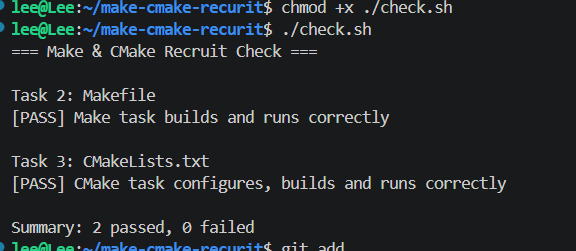

# Task 4：思考题

## 1. Make 和简单的 build.sh 有什么区别？

Make可以根据文件的修改时间来判断是否需要重新生成相关文件，可处理依赖关系，而build.sh每次都需完整重新编译

## 2. CMake 是编译器吗？

执行 `cmake --build build` 时，最终是谁在编译 C 源文件？

不是。CMake可生成Makefile等配置文件，是gcc等C编译器。

## 3. 为什么不希望每次都重新编译所有 `.c` 文件？

因为有的.c文件内容没有更改，生成的.o不会改变，为了节约时间（尤其是大型项目完全重新编译更耗费时间），节约电能

## 运行成功截图
